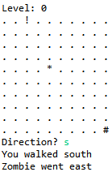

# Extra credit: Zombie Apocalypse  

Create a text-based zombie game called Zombie.java. The game is played starting on a 10x10 grid. You start in the upper-left corner. Your goal is to reach the safety of the mall in the lower-right corner without getting eaten.    

  

  

  

Luckily it is early in the zombie apocalypse so you only have one zombie to worry about. Every turn you move north, south, east or west by typing 'n' 's' 'e' or 'w' respectively. If you type an invalid character or try and go off the grid, you lose your turn. If you are dumb enough to walk into the current position of the zombie, kiss your brain goodbye.  

The zombie also moves north, south, east or west and must remain on the grid. The zombie cannot enter the mall. The zombie always chooses a valid move but chooses the direction at random (it hasn't learned to smell brains yet). If the zombie's move and your move result in the same location, say goodbye to your grey matter.  

A level is completed when you reach the mall. There are nine levels and in each level the size of the grid is reduced by one (the final level is 2x2). You win if you complete all levels. Empty grid cells appear as '.', the zombie is '*', the mall is '#', and you are '!'.  

**How do I read in a number from the user?** You need to use the [StdIn.java](StdIn.java) class and place it in the same directory as your Zombie.java program. When you want your program to read in a command from the user, call the method StdIn.readString(). For an example program, see [OrderProduct.java](OrderProduct.java).  

**Extra-extra credit.** There is plenty of scope for improvements such as: a smarter zombie, multiple zombies, obstacles on the grid, etc. The zombie-infected world is your oyster!  

---

This README was adapted from an assignment page at Montana Tech: https://katie.cs.mtech.edu/classes/archive/f13/csci135/assign/loops/
