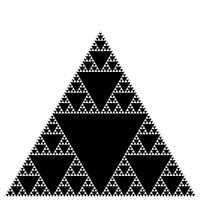

# Part 1  

The *Sierpinski triangle* is another example of a fractal pattern like the H-tree pattern we covered in the [lecture on recursion](https://katie.cs.mtech.edu/classes/archive/f13/csci135/slides/135-recursion.pdf). The Polish mathematician Wacław Sierpiński described the pattern in 1915, but it has appeared in Italian art since the 13th century. Though the Sierpinski triangle looks complex, it can be generated with a short recursive program. Your task is to write a program Sierpinski.java with a recursive function sierpinski() and a main() function that calls the recursive function once, and plots the result using standard drawing. Think recursively: sierpinski() should draw one filled equilateral triangle (pointed downwards) and then call itself recursively 3 times (with an appropriate stopping condition). When writing your program, exercise modular design: include a (non-recursive) function filledTriangle() that draws a filled equilateral triangle of a specified size at a specified location.  

Your program shall take one integer command-line argument N, to control the depth of the recursion. All of the drawing should fit snugly inside the equilateral triangle with endpoints (0, 0), (1, 0), and (1/2, √3/2). Do NOT change the scale of the drawing window. First, make sure that your program draws a single filled equilateral triangle when N equals 1. Then, check that it draws four filled equilateral triangles when N equals 2. Your program will be nearly (or completely) debugged when you get to this point.  

**API specification.** Your program Sierpinski.java must be organized as a library of static methods with the following API:  

   public class Sierpinski  
   \-\-\-\-\-\-\-\-\-\-\-\-\-\-\-\-\-\-\-\-\-\-\-\-\-\-\-\-\-\-\-\-\-\-\-\-\-\-\-\-\-\-\-\-\-\-\-\-\-\-\-\-\-\-\-\-\-\-\-\-\-\-\-\-\-\-\-\-\-\-\-\-\-\-\-\-\-\-\-\-  
   void filledTriangle(double x, double y, double s)     // draw shaded equilateral triangle with  
                                                            bottom vertex (x, y), side length s  
 
   void sierpinski(int n, double x, double y, double s)  // draw one triangle, bottom vertex (x, y), side s;  
                                                            recursively call itself three times to generate  
                                                            the next order Sierpinski triangles above, left  
                                                            and right of current triangle  
  
   void main(String[] args)                              // read order of recursion N as a command-line  
                                                            argument; draw gray outline triangle with endpoints  
                                                            (0, 0), (1, 0), and (1/2, √3/2); generate an  
                                                            N-order Sierpinski triangle inside the outline  
                                                              
**Examples.** Below are the target Sierpinski triangles for different values of *N*.  

   % java Sierpinski 1	 
   
     
   
   % java Sierpinski 2	
   
     
   
   % java Sierpinski 3  
   
     
   
   % java Sierpinski 4	
   
     
   
   % java Sierpinski 5	
   
     
   
   % java Sierpinski 6  
   
     
   
    
**A diversion: fractal dimension.** In grade school, we learn that the dimension of a line segment is one, the dimension of a square is two, and the dimension of a cube is three. But you probably didn't learn what is really meant by *dimension*. How can we express what it means mathematically or computationally? Formally, we can define the *Hausdorff dimension* or *similarity dimension* of a self-similar figure by partitioning the figure into a number of self-similar pieces of smaller size. We define the dimension to be the log (# self similar pieces) / log (scaling factor in each spatial direction). For example, we can decompose the unit square into 4 smaller squares, each of side length 1/2; or we can decompose it into 25 squares, each of side length 1/5. Here, the number of self-similar pieces is 4 (or 25) and the scaling factor is 2 (or 5). Thus, the dimension of a square is 2 since log (4) / log(2) = log (25) / log (5) = 2. We can decompose the unit cube into 8 cubes, each of side length 1/2; or we can decompose it into 125 cubes, each of side length 1/5. Therefore, the dimension of a cube is log(8) / log (2) = log(125) / log(5) = 3.

We can also apply this definition directly to the (set of white points in) Sierpinski triangle. We can decompose the unit Sierpinski triangle into 3 Sierpinski triangles, each of side length 1/2. Thus, the dimension of a Sierpinski triangle is log (3) / log (2) ≈ 1.585. Its dimension is fractional—more than a line segment, but less than a square! With Euclidean geometry, the dimension is always an integer; with fractal geometry, it can be any fraction. Fractals are widely applicable for describing physical objects like the coastline of Britain.

---

This assignment page was adapted from one at Princeton: http://www.cs.princeton.edu/courses/archive/fall11/cos126/assignments/sierpinski.html

---

This README was adapted from an assignment page at Montana Tech: https://katie.cs.mtech.edu/classes/archive/f13/csci135/assign/sierpinski/
