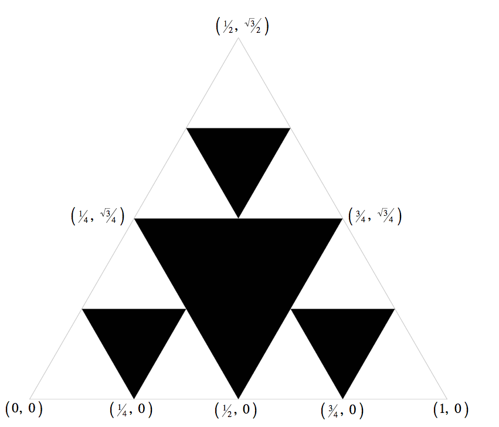

# Part 2  

In this part you will design and create your own recursive fractal. Your job is to write a program Art.java that takes *one* integer command-line argument *N* (to control the depth of recursion) and produces a *recursive* pattern of your own choosing. It should work and stay within the drawing window for values 1 through 7. You are free to choose a geometric pattern (like, but not too similar to, Htree or Sierpinski) or a random construction. Your design should not be easy to generate with iteration alone. Originality and creativity in the design will be a factor in your grade.  

* Your Art.java program must take one integer command-line argument N (expect it to be between 1 and 7).  

**I forget how to do geometry. Any hints?** Here are the coordinates of the critical endpoints. Click the image for a bigger version.  

  

**How do I draw an equilateral triangle?** Use StdDraw.polygon() or StdDraw.filledPolygon() with appropriate parameters.  

**Should I be calling StdDraw.setCanvasSize(), StdDraw.setXscale(), StdDraw.setYscale(), or StdDraw.save()?** No.  

**May I use a different color from black to fill in the triangles?** Yes, you may use any color that contrasts with the white background.  

**How should I go about doing the artistic part of the assignment?** This part is meant to be fun, but here are some guidelines in case you're not so artistic. A very good approach is to first choose a self-referential pattern as a target output. Check out the graphics exercises in [Section 2.3](http://introcs.cs.princeton.edu/23recursion). Here are some good ones from Princeton's [Fall '10 class](http://www.cs.princeton.edu/courses/archive/fall10/cos126/art/index.php). See also the Famous Fractals in [Fractals Unleashed](http://library.thinkquest.org/26242/full/fm/fm.html) for some ideas. Here is a [list of fractals, by Hausdorff dimension](http://en.wikipedia.org/wiki/List_of_fractals_by_Hausdorff_dimension). Some pictures are harder to generate than others (and some require trig).  

**What will cause me to lose points on the artistic part?** We will deduct points if your picture is too similar to Htree or Sierpinski. To be "different enough" from those algorithms, you need to change the recursive part of the program. For example, it is *not* sufficient to simply substitute squares for triangles in Sierpinski. You will also lose points if your artwork can be more easily created without recursion. This is indicated by a *tail-recursive* function, e.g., a recursive function that calls itself as its last action. For example, the recursive factorial method shown in lecture was tail-recursive.  

**May I use .gif, .jpg, or .png in my artistic creation?** Yes. If so, be sure to submit them along with your other files.  

**My function for Art.java takes several parameters, but the assignment says that I can only read in one command-line argument N. What should I do?** Choose a few of the best parameter values and do something like the following:  

if      (N == 1) { x = 0.55; y = 0.75; n = 3; }  
else if (N == 2) { x = 0.55; y = 0.75; n = 5; }  
else if (N == 3) { x = 0.32; y = 0.71; n = 8; }  
else if ...  

-----
This assignment page was adapted from one at Princeton: http://www.cs.princeton.edu/courses/archive/fall11/cos126/assignments/sierpinski.html

-----
This READEME was adapted from one at Montana Tech: https://katie.cs.mtech.edu/classes/archive/f13/csci135/assign/sierpinski/
