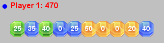

# ASSIGNMENT #9 - Gem Matching  

In this assignment, you will be creating a Gem Matching game. Your job is to write two support classes used by the game. You will learn to implement a linked list in Java as well how to use an enumerated type.	  

**Gem Matching.** The game is played by two players who take turns placing a gem. Each new gem is randomly one of three different colors and has a random point value. A player may place a gem in their own row of gems to increase their score. A player may also place a gem in their opponent's row to break up a gem *block*. A *block* is any group of consecutive gems of the same color.  

A player's score is determined by summing the point total of all gems in their row. Blocks in a player's row incur a score multiplier. The score multiplier is the number of gems in the block. For example, a block of three green gems with point values 10, 20, and 30 would earn 3 * (10 + 20 + 30) = 180 points. Due to the multiplier, it can sometimes be advantageous to give a gem to your opponent since you can use it to break up a block. The game ends when either player hits 16 total gems.  

**Files.** The file [gem.zip](gem.zip) contains the three image files for green, blue and orange gems. It also contains three Java classes. You have been given a completely finished version of GemGame.java. You will be implementing the two support classes Gem.java and GemList.java.  

Gem. The Gem class represents a single gem in the game. It knows things like its color (green, blue, or orange) and its point value. You should use the provided enumerated type to represent the color of a gem. A new gem is assigned one of the three colors at random. The point value of a gem is a random value in the set {0, 5, 10, 15, 20, 25, 30, 35, 40, 45, 50}. Gems are drawn first using one of the image files [gem_green.png](gem_green.png), [gem_blue.png](gem_blue.png), or [gem_orange.png](gem_orange.png). The point value is then drawn in a white text over the image.

Here is the API you should implement for the Gem class:  
<pre>
public class Gem
-----------------------------------------------------------------------------------------
         Gem()                         // create a gem with random color and point value
         Gem(GemType type, int points) // create a gem with the specified color and point value
  String toString()                    // return a string representation of the gem
 GemType getType()                     // get the type of the gem
     int getPoints()                   // get point value of the gem
    void draw(double x, double y)      // draw the gem centers at (x, y)
</pre>

We have provided a test main() method. Here is the console and StdDraw output from our program. NOTE: the row of 16 gems is using the constructor that creates a random gem, so you are unlikely to get the same thing we did!  

```console
% java Gem
GREEN 10, GREEN, 10
BLUE 20, BLUE, 20
ORANGE 30, ORANGE, 30
```
  

**GemList.** The GemList classes represents all the gems held by a player as well as their order. The class allows new gems to be inserted anywhere in the list by specifying the integer index of the gem to insert before. You are required to implement this using a linked list data structure. Each Node in the linked list will contain a Gem and a reference to the next Node in the list. Within GemList.java, define a nested class Node in the standard way:  
```
private class Node
{
    private Gem	 gem;
    private Node next;
}
```

Your GemList data type must implement the following API:  
<pre>
public class GemList
-----------------------------------------------------------------------------------------
     int size()                            // return the number of gems in the list   
    void draw(double y)                    // draw all the gems in the list at the given y-coordinate
  String toString()                        // return a string representation of the list
    void insertBefore(Gem gem, int index)  // insert the given gem before the 0-based index in the existing list
                                           // if index is >= size of the list, the new gem is inserted at the end
     int score()                           // calculate the total score of the list 
</pre>

As we mentioned previously, in order to score a list of gems, you need to apply score multipliers for any blocks of gems of the same color. So for example:  
  
* First block - one green gem, 25 = 1 * (25)
* Second block - one blue gem, 35 = 1 * (35)
* Third block - one green gem, 40 = 1 * (40)
* Fourth block - two blue gems, 50 = 2 * (0 + 25)
* Fifth block - four yellow gems, 280 = 4 * (50 + 0 + 0 + 20)
* Sixth block - one blue gem, 40 = 1 * (40)
* Total - 470 = 25 + 35 + 40 + 50 + 280 + 40  

We have provided a test main() method. Here is the console and StdDraw output from our program:  
```console
% java GemList

size = 0, score = 0
BLUE 10
size = 1, score = 10
BLUE 20 -> BLUE 10
size = 2, score = 60
BLUE 20 -> ORANGE 30 -> BLUE 10
size = 3, score = 60
BLUE 20 -> ORANGE 30 -> ORANGE 10 -> ORANGE 0 -> BLUE 10
size = 5, score = 150
BLUE 20 -> ORANGE 30 -> ORANGE 10 -> ORANGE 0 -> BLUE 10 -> BLUE 50
size = 6, score = 260
BLUE 20 -> ORANGE 30 -> GREEN 50 -> ORANGE 10 -> ORANGE 0 -> BLUE 10 -> BLUE 50
size = 7, score = 240
```

---

**Do I need to follow the prescribed APIs?** Yes. You may not add public methods to the API; however, you may add private methods if you wish (which are only accessible in the class in which they are declared).  

**How do I set the font type and size that StdDraw.text() uses?** Our Gem point total used: StdDraw.setFont(new Font("SansSerif", Font.BOLD, 14))  

**How does GemList.draw() figure out the x-coordinate for drawing the Gem objects?** You can use the static method indexToX() we provided in the GemGame class.  

**What is the file GemList$Node.class?** When you declare a *nested* class like Node, the Java compiler uses the $ symbol to mark its name.

**Can I use Java's built in LinkedList class?** Absolutely not! One of the main goals of this assignment is to gain experience writing and using linked structures. The Java libraries can only take you so far, and you will quickly discover applications which cannot be solved without devising your own linked structures. Stay tuned.

**When implementing my insertBefore() method, what special cases should I worry about?** At a minimum you should worry about inserting into a completely empty list and inserting at the very start of the list.

**When implementing draw() in GemList how do I determine the x-coordinate to draw each gem at?** We have provided a static helper method indexToX() in GemGame. You can call this method to calculate the x-coordinate based on the index position of a gem in the linked list.

---

**Extra credit idea 1.** Create a new version of the game in which the second player is the computer. When it is the computer's turn, it should evaluate the best possible location to put the gem. It should maximize the difference between the computer's score and the human's score. Hint: you'll probably want to implement a method in your GemList class that lets you delete an item at a specific index. This will allow you to temporarily insert the current gem into all possible locations in both player's gem lists. The video on the right shows an example of our computer opponent version.

**Extra credit idea 2.** Make the game more interesting by adding additional types of playing pieces. For example, there could be a *bomb* piece that can be used to blow up part of your opponent's row. Other ideas would be a *wildcard* piece that matches any color or that increases a block's score multiplier.

**Extra credit idea 3.** Change the game so you only score points when you make a run of so many gems. Once a run is made, the gems blow up and the player scores points based on the gems in the run. This will make the game continue as long as both players are able to complete runs to free up space in their gem row.
